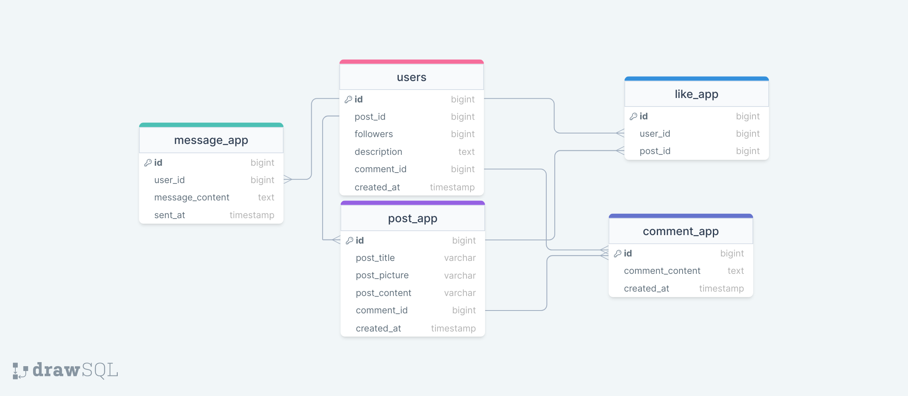
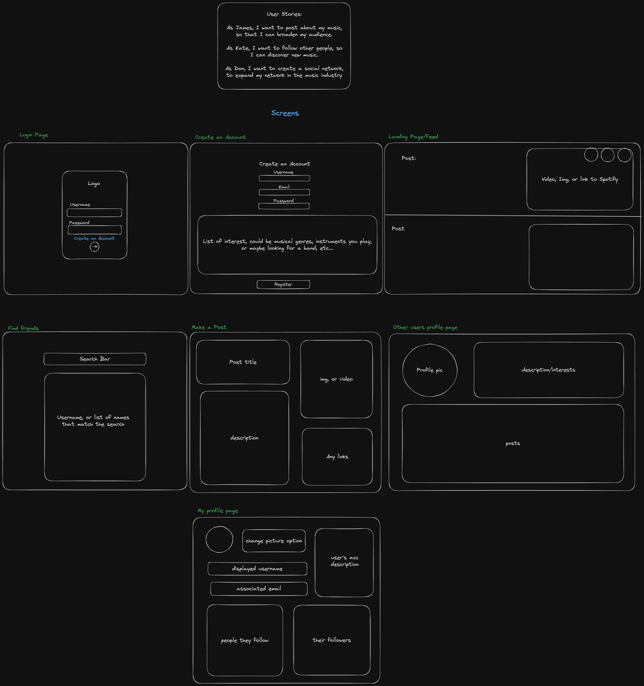

# Sonic Showcase

Sonic Showcase is a personal project meant to showcase my abilities as a software developer. Sonic Showcase is a social media platform meant for sharing music in any form. 

## Features

- Authenticated Register/Login
- View user's posts on your home page
- Edit your profile information
- Search for users and view their page and posts
- like and comment on posts
- make posts with img or video files
- link spotify tracks in your posts
- search for users by username

### Features I'd like to implement in the future

- message other users
- timestamps for posts and comments in the form of x minutes ago etc.
- edit posts
- delete posts
- delete account
- delete comments on your post
- delete comments you make
- tags for posts
- sort by for posts

